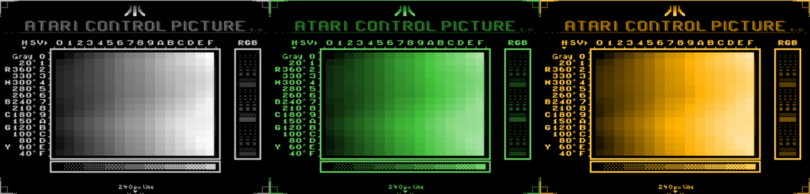

# SOPHIA-COLORS

A custom palettes for Sophia GTIA replacement.

## Tools

Both programs should be run from [SpartaDos X](https://sdx.atari8.info/index.php).

First one, ``lpal01.com``, loads four custom palettes into a Sophia RAM: 
0. *built-in default, intact*
1. NTSC
2. Gray
3. Green
4. Amber

Second tool, ``spal.com`` should be called with number ``0`` to ``15`` to 
select an pre-loaded palette. 

**Beware**: selecting "empty" palette render system a slightly inconvenient, 
i.e. with black background and black letters. In such case don't push ``RESET``!
Simply type a ``spal 0`` command, to restore default behaviour.

Palettes persists between reboots but disappears after a power-off (they 
are located in Sophia's internal memory).

## Building

Both binaries were created with [MAD-ASSEMBLER](https://mads.atari8.info/mads.html)

```
mads lpal01.fas -o:lpal01.com
mads spal.fas   -o:spal.com
```

## Palette set 1

Provided by ``lpal01.com``. Monochrome ones were created manually, they don't
emulate any existing CRT monitor. Treat them as a free variation about old
memories.




